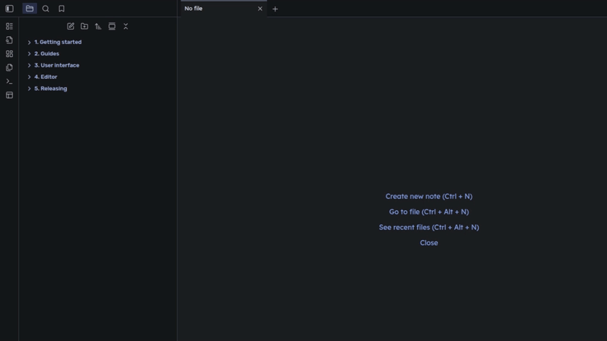
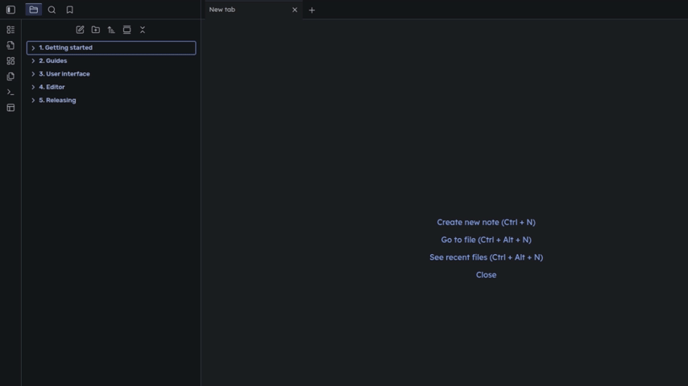

# Obsidian Sidebar Keyboard Navigation

[Obsidian](https://obsidian.md/) plugin to provide keyboard based workflow(*Vim-like*) in
the native [File Explorer](https://help.obsidian.md/plugins/file-explorer).
Inspired by popular Vim plugins like NERDTree and Neo-tree.

This plugin fills the gaps in the native app's functionality for users who rely on a keyboard-based workflow and do not
use custom file explorers (via community plugins).

## Features

- Use intuitive mappings for the native Obsidian actions.
- Disable certain keys, if they interfere with your workflow (or other plugins).
- Minimal invasion to the native app behavior (and your note-taking workflow).
- Changes(improvements) to the native app features
	- **Avoid duplicating opened files**: if trying to open an already opened file - focus it, instead of opening a
		duplicate tab (enabled/disabled in Settings).
	- **Background opening**: for most file-opening actions, there is an alternative action to allow you to open files "in
		background", while keep the focus on the File Explorer.
	- **Deselect all items** via new key-binding.
	- After deleting a node in the File Explorer, automatically focus next/prev node, instead of loosing focus.

## Showcase

### Navigate files

### Preview files

### Create splits

### Edit files/folders

## Current State of The Plugin

The plugin is relatively new and under active development, so please use a sandbox(testing) Vault before enabling the
plugin for your main Vault. 
While current keyboard shortcuts have been thoroughly designed and made to be future-proof, they are subject to change
(though unlikely).

## Installation

### Install via BRAT

The plugin currently is going through the review process, so it's not available in the community plugins repository
yet. 
For now, you can use the [BRAT](https://tfthacker.com/BRAT) community plugin for installation and updating.

### Manual Installation

1. Clone(or download zip) repository code
2. Put obtained directory into `YourValutFolder/.obsidian/plugins/`

## Usage

1. (Optional) Consider reviewing/setting the following key bindings provided by Obsidian, so you can use the File
	 Explorer more efficiently:
	- `Files: Show file explorer`: focus the File Explorer (e.g. `Alt+P`)
	- `Toggle left sidebar`: toggle the File Explorer (e.g. `Alt+Shift+P`)
	- `Files: Reveal current file in navigation`: (e.g. `Alt+F1`, similar to one in Intellij IDEA)
	- `Focus on tab group to the right/lef/below/above`: to switch between opened splits (e.g.
		`Ctrl- L/H/J/K`). You can also use `Esc` to switch from the File Explorer to the most recent Split.
2. (Optional) Open and review plugin settings.
3. Focus the File Explorer using `Files: Show file explorer` or `File: Reveal current file in navigation` command (
	 shortcut or from the Command Palette).
4. Use [supported key bindings](#available-actions) to navigate and interact with nodes.
	- For new users it's suggested to start with the most basic commands - `j`/`k`/`h`/`k`/`n`/`f`, and introduce more
		advanced actions gradually.

If, after some operation (e.g. after deleting a note via default mapping - `Ctrl-Shift-D`), you see that no nodes
focused(focus lost) - just press `j` or `k` to get focus back.

## Available Actions

> **NOTE:** "focused node" - node with the cursor positioned on it(usually bordered), "selected node" - node selected
> via selection 
> Bindings are currently limited to using a single key character, and `Ctrl`/`Alt` modifiers are not used as these
> likely
> to interfere with the native bindings.

|        Key         | Action                                                                                                                                | Description                                                                                                                                                                                                                                                                                                                                      |                                                                                                                                           
|:------------------:|:--------------------------------------------------------------------------------------------------------------------------------------|:-------------------------------------------------------------------------------------------------------------------------------------------------------------------------------------------------------------------------------------------------------------------------------------------------------------------------------------------------|
| **Base Movements** |                                                                                                                                       |                                                                                                                                                                                                                                                                                                                                                  |
|        `?`         | toggle help menu                                                                                                                      |                                                                                                                                                                                                                                                                                                                                                  |
|        `j`         | move down                                                                                                                             | Also works for context menu                                                                                                                                                                                                                                                                                                                      |
|        `J`         | move down, and if a file focused - preview in the Editor without switching focus                                                      | Native: `Ctrl + ArrowDown`                                                                                                                                                                                                                                                                                                                       | 
|        `k`         | move up                                                                                                                               | Also works for context menu                                                                                                                                                                                                                                                                                                                      |
|        `K`         | move up, and if a file focused - preview in the Editor without switching focus                                                        | Native: `Ctrl + ArrowUp`                                                                                                                                                                                                                                                                                                                         | 
|        `g`         | focus the topmost root node                                                                                                           |                                                                                                                                                                                                                                                                                                                                                  |
|        `G`         | focus the bottommost root node                                                                                                        |                                                                                                                                                                                                                                                                                                                                                  |
|        `v`         | toggle selection on focused node                                                                                                      |                                                                                                                                                                                                                                                                                                                                                  |
|        `V`         | clear selection (deselect all nodes)                                                                                                  |                                                                                                                                                                                                                                                                                                                                                  |
|        `;`         | toggle context menu for focused node                                                                                                  |                                                                                                                                                                                                                                                                                                                                                  |
|     **Folds**      |                                                                                                                                       |                                                                                                                                                                                                                                                                                                                                                  |
|        `h`         | a) *if an opened folder or a file focused* - close the current folder b) *if a closed folder focused* -  jump to the parent folder |                                                                                                                                                                                                                                                                                                                                                  |
|        `H`         | a) *if an opened folder focused* - close it recursively b) *if a closed folder, or a file focused* - jump to  the parent folder    |                                                                                                                                                                                                                                                                                                                                                  |
|        `l`         | a) *if a folder focused* - open it b) *if a file focused* - open it in the recently active Editor                                  |                                                                                                                                                                                                                                                                                                                                                  |
|        `L`         | a) *if a folder focused* - expand it recursively b) *if a file focused* - open it, but keep focus on File Explorer                 |                                                                                                                                                                                                                                                                                                                                                  |
|        `Z`         | close all Vault folders recursively                                                                                                   |                                                                                                                                                                                                                                                                                                                                                  |
| **Opening Files**  |                                                                                                                                       |                                                                                                                                                                                                                                                                                                                                                  |
|        `t`         | open focused file in a new tab                                                                                                        | Native: `Ctrl + Enter`                                                                                                                                                                                                                                                                                                                           |
|        `T`         | open focused file in a new tab, but keep focus on File Explorer                                                                       |                                                                                                                                                                                                                                                                                                                                                  |
|        `s`         | open focused file in a new vertical split                                                                                             | Native: `Open to the right`                                                                                                                                                                                                                                                                                                                      |
|        `S`         | open focused file in a new vertical split, but keep focus on File Explorer                                                            |                                                                                                                                                                                                                                                                                                                                                  |
|        `i`         | open focused file in a new horizontal split                                                                                           |                                                                                                                                                                                                                                                                                                                                                  |
|        `I`         | open focused file in a new horizontal split, but keep focus on File Explorer                                                          |                                                                                                                                                                                                                                                                                                                                                  |
|        `w`         | open selected files, or focused file in a new window                                                                                  |                                                                                                                                                                                                                                                                                                                                                  |
|        `o`         | show popup preview for the focused file                                                                                               | This action is still work-in-progress. Currently, the action doesn't provide auto-hiding for the popup.  So you should hide it manually for each node  by pressing `o` again, while focused the same node, before continuing with other actions. Alternatively, you can just mouse-click/mouse-move outside of the popup to hide it. |
| **Updating Files** |                                                                                                                                       |                                                                                                                                                                                                                                                                                                                                                  |
|        `n`         | create a new note inside the focused folder                                                                                           | If a folder is focused, this action will create new note **in that folder**                                                                                                                                                                                                                                                                      |
|        `N`         | create a new note inside the parent folder                                                                                            | If a folder is focused, this action will create new note **in the parent folder**                                                                                                                                                                                                                                                                |
|        `f`         | create a new folder inside the focused folder                                                                                         |                                                                                                                                                                                                                                                                                                                                                  |
|        `F`         | create a new folder inside the parent folder                                                                                          |                                                                                                                                                                                                                                                                                                                                                  |
|        `r`         | rename focused node                                                                                                                   | Native: `Rename file`                                                                                                                                                                                                                                                                                                                            |
|        `c`         | clone focused node                                                                                                                    |                                                                                                                                                                                                                                                                                                                                                  |
|        `D`         | a) *if some nodes selected* - delete selected nodes b) *otherwise* - delete focused node                                           | Native: `Delete` shortcut                                                                                                                                                                                                                                                                                                                        |

> **NOTE:** mappings for some destructive actions (e.g. delete note/folder) are disabled by default in Settings,
> so you don't accidentally damage your precious stuff while exploring the plugin for the first time.

## Known Bugs and Current Limitations

- This plugin is indented to be used with the core [File Explorer](https://help.obsidian.md/plugins/file-explorer)
	plugin. So it might break the functionality of your other plugins if they change the behaviour of the File Explorer.
- **The mappings will differ for non-QWERTY keyboard layouts**.
- **Key bindings are not configurable** as it might introduce unnecessary complexity for users (and
	development). Current bindings are based on similar classic plugins for Vim (like NERDTree).
- **Background-opening:** (`T`, `S`, `I`)
	- The position of a new tab/split will be related to the most recently focused split(or tab group). _There are
		some ideas how it could be improved, but more feedback needed_.
	- This feature may introduce unnecessary complexity to your workflow, if you try to build a workspace layout with
		3+ splits using these actions. So use accordingly.
- **Multi-selection:** if you have some nodes selected (via `v`) and you move focus to a non-selected node,
	invoking the context menu (`;`) will open it for the focused node. If you want to show the context menu for the
	selected nodes - you should move focus to one of selected nodes. _There is no technical limitation to fix it, but more
	feedback needed._
