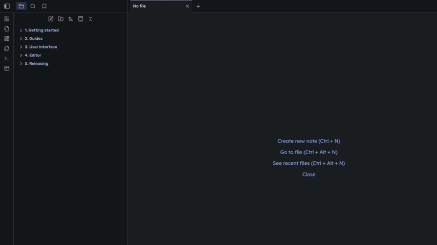
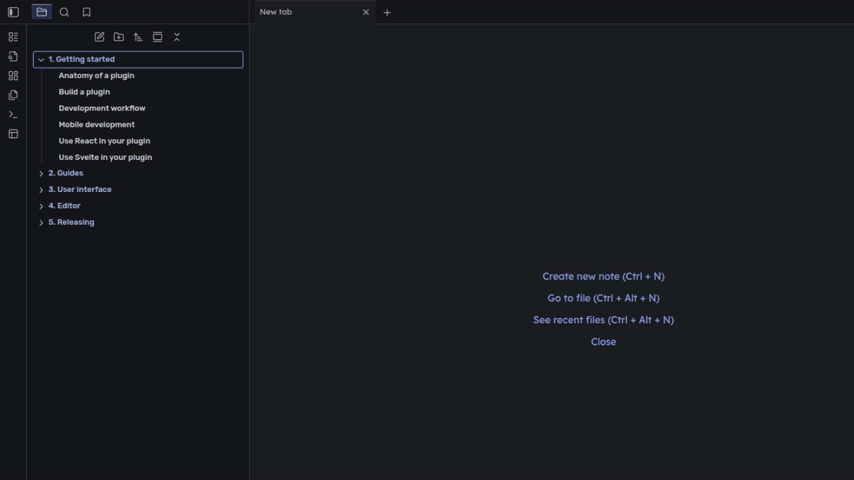
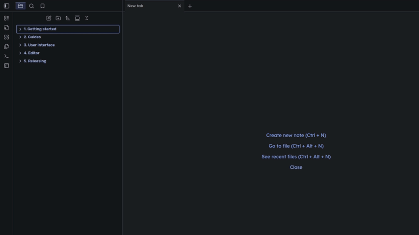

# Obsidian Sidebar Keyboard Navigation

[Obsidian](https://obsidian.md/) plugin to enable keyboard based workflow(*Vim-like*) in
the native [File Explorer](https://help.obsidian.md/plugins/file-explorer).
Inspired by popular Vim plugins like NERDTree and Neo-tree.

For Vim users, Obsidian currently allows using Vim-mode in the Editor (enabled in Settings), but not in other tools
windows, like File Explorer. 
So the goal of this plugin is to fill this gap for users who heavily rely on a keyboard-based workflow.

## Features

- Use keyboard to perform common actions in the File Explorer
- Option to disable certain keys, if they interfere with your workflow (or other plugins)
- Minimal invasion to the native app behavior (and your note-taking workflow)
- Changes(improvements) to the native app features
	- **Avoid duplicating opened files**: if trying to open an already opened file - focus it, instead of opening a
		duplicate tab (enabled/disabled in Settings).
	- **Background opening**: for most file-opening actions, there is an alternative action to allow you to open files "in
		background", while keep the focus on the File Explorer.
	- **Deselect all items**: new action.
	- After deleting a node in the File Explorer, automatically focus next/prev node, instead of loosing focus.

## Showcase

Navigate files

Preview files

Create splits

Edit files/folders

## Installation

### Install via BRAT

The plugin currently is going through the review process, so it's not available in the community plugins repository
yet. 
For now, you can use the [BRAT](https://tfthacker.com/BRAT) community plugin for installation and updating.

### Manual Installation

1. Download assets (`main.js`, `manifest.json`, `styles.css`) from
	 the [releases](https://github.com/denvolok/obsidian-sidebar-keyboard-navigation/releases) page
2. Create plugin folder in `VAULT_DIR/.obsidian/plugins/sidebar-keyboard-navigation`
3. Put downloaded assets into the plugin folder

## Usage

1. (Optional) Consider reviewing/setting the following key bindings provided by Obsidian, so you can use the File
	 Explorer more efficiently:
	- `Files: Show file explorer`: focus the File Explorer (e.g. `Alt+P`)
	- `Toggle left sidebar`: toggle the File Explorer (e.g. `Alt+Shift+P`)
	- `Files: Reveal current file in navigation`: (e.g. `Alt+F1`, similar to one in Intellij IDEA)
	- `Focus on tab group to the right/lef/below/above`: to switch between opened splits (e.g.
		`Ctrl- L/H/J/K`). You can also use `Esc` to switch from the File Explorer to the most recent Split.
2. (Optional) Open and review plugin settings.
3. Focus the File Explorer using `Files: Show file explorer` or `File: Reveal current file in navigation` command (
	 shortcut or from the Command Palette).
4. Use [supported key bindings](#available-actions) to navigate and interact with nodes.
	- For new users it's suggested to start with the most basic commands - `j`/`k`/`h`/`k`/`n`/`f`, and introduce more
		advanced actions gradually.

If, after some operation (e.g. after deleting a note via default mapping - `Ctrl-Shift-D`), you see that no nodes
focused(focus lost) - just press `j` or `k` to get focus back.

## Available Actions

> **NOTES:**
> - All key bindings currently limited to use only a single key press, and `Ctrl`/`Alt` modifiers are not used, as these
		> likely to interfere with the native bindings.
> - **Node** - an entry in sidebar tool windows (file or folder for File Explorer)
> - **Focused node** - a node with the cursor positioned on it(usually bordered)
> - **Selected node** - a node selected via selection
> - **File** - any file type visible in the File Explorer (e.g. `.md`, `.pdf`)
> - **Note** - a `.md` File
> - **Background-opening** - opening a file without switching focus to the Editor

|        Key         | Action                                                                                                                                | Description                                                                                                                                                                                                                                                                                                             |                                                                                                                                           
|:------------------:|:--------------------------------------------------------------------------------------------------------------------------------------|:------------------------------------------------------------------------------------------------------------------------------------------------------------------------------------------------------------------------------------------------------------------------------------------------------------------------|
| **Base Movements** |                                                                                                                                       |                                                                                                                                                                                                                                                                                                                         |
|        `?`         | toggle help menu                                                                                                                      |                                                                                                                                                                                                                                                                                                                         |
|        `j`         | move down                                                                                                                             | Also works for context menu                                                                                                                                                                                                                                                                                             |
|        `J`         | move down, and if a file focused - background-open focused file                                                                       | Native: `Ctrl + ArrowDown`. Can be used to quickly preview files in a folder                                                                                                                                                                                                                                         | 
|        `k`         | move up                                                                                                                               | Also works for context menu                                                                                                                                                                                                                                                                                             |
|        `K`         | move up, and if a file focused - background-open focused file                                                                         | Native: `Ctrl + ArrowUp`. Can be used to quickly preview files in a folder                                                                                                                                                                                                                                           | 
|        `g`         | focus the topmost root node                                                                                                           |                                                                                                                                                                                                                                                                                                                         |
|        `G`         | focus the bottommost root node                                                                                                        |                                                                                                                                                                                                                                                                                                                         |
|        `v`         | toggle selection on focused node                                                                                                      |                                                                                                                                                                                                                                                                                                                         |
|        `V`         | clear selection (deselect all nodes)                                                                                                  |                                                                                                                                                                                                                                                                                                                         |
|        `;`         | toggle context menu for focused(or selected) node(s)                                                                                  | If you want to invoke context menu for selected nodes - the focus should be on some of selected nodes                                                                                                                                                                                                                   |
|     **Folds**      |                                                                                                                                       |                                                                                                                                                                                                                                                                                                                         |
|        `h`         | a) *if an opened folder or a file focused* - close the current folder b) *if a closed folder focused* -  jump to the parent folder |                                                                                                                                                                                                                                                                                                                         |
|        `H`         | a) *if an opened folder focused* - close it recursively b) *if a closed folder, or a file focused* - jump to  the parent folder    |                                                                                                                                                                                                                                                                                                                         |
|        `l`         | a) *if a folder focused* - open it b) *if a file focused* - open it in the recently active Editor                                  |                                                                                                                                                                                                                                                                                                                         |
|        `L`         | a) *if a folder focused* - expand it recursively b) *if a file focused* - open it, but keep focus on File Explorer                 |                                                                                                                                                                                                                                                                                                                         |
|        `Z`         | close all folders recursively                                                                                                         |                                                                                                                                                                                                                                                                                                                         |
| **Opening Files**  |                                                                                                                                       |                                                                                                                                                                                                                                                                                                                         |
|        `t`         | open focused file in a new tab                                                                                                        | Native: `Ctrl + Enter`                                                                                                                                                                                                                                                                                                  |
|        `T`         | background-open focused file in a new tab                                                                                             |                                                                                                                                                                                                                                                                                                                         |
|        `s`         | open focused file in a new vertical split                                                                                             | Native: `Open to the right`                                                                                                                                                                                                                                                                                             |
|        `S`         | background-open focused file in a new vertical split                                                                                  |                                                                                                                                                                                                                                                                                                                         |
|        `i`         | open focused file in a new horizontal split                                                                                           |                                                                                                                                                                                                                                                                                                                         |
|        `I`         | background-open focused file in a new horizontal split                                                                                |                                                                                                                                                                                                                                                                                                                         |
|        `w`         | open selected files (or focused file) in a new window                                                                                 |                                                                                                                                                                                                                                                                                                                         |
|        `o`         | show popup preview for the focused file                                                                                               | Native: `Ctrl + MouseOver`. This action is still work-in-progress. Currently, the action doesn't provide auto-hiding for the popup,  so you should hide it manually by pressing `o` again, while focused the same node. Alternatively, you can just mouse-click/mouse-move outside of the popup to hide it. |
|    **Editing**     |                                                                                                                                       |                                                                                                                                                                                                                                                                                                                         |
|        `n`         | create a new note inside the current/focused folder                                                                                   | If a folder is focused, this action will create new note **in that folder**                                                                                                                                                                                                                                             |
|        `N`         | create a new note inside the parent folder                                                                                            | If a folder is focused, this action will create new note **in the parent folder**                                                                                                                                                                                                                                       |
|        `f`         | create a new folder inside the current/focused folder                                                                                 |                                                                                                                                                                                                                                                                                                                         |
|        `F`         | create a new folder inside the parent folder                                                                                          |                                                                                                                                                                                                                                                                                                                         |
|        `r`         | rename focused node                                                                                                                   | Native: `Rename` (context menu)                                                                                                                                                                                                                                                                                         |
|        `c`         | clone focused node                                                                                                                    | Native: `Make a copy` (context menu)                                                                                                                                                                                                                                                                                    |
|        `D`         | a) *if some nodes selected* - delete selected nodes b) *otherwise* - delete focused node                                           | Native: `Delete` (shortcut)                                                                                                                                                                                                                                                                                             |

> **NOTE:** mappings for some destructive actions (e.g. delete note/folder) are disabled by default in Settings,
> so you don't accidentally damage your precious stuff while exploring the plugin for the first time.

## How It Works

When one of supported leafs (tool windows) (e.g. File Explorer) is focused, the plugin is starting listening for
`keydown` events to invoke appropriate actions. 
To implement actions logic, where possible, the plugin tries to use the most abstract native(obsidian/browser)
functions (e.g.
`onKeyArrowDown`, `setFocusedItem`) to minimize any conflicts/bugs. 
For some actions, it's necessary to mimic the logic from internal functions and apply some changes.

**APIs used by the plugin:**

- **DOM:** mostly for reading the state (except for rendering the help modal, and highlighting focused tab)
- **Event:** dispatching events to mimic native app behavior
- **Obsidian**: using internal (non-sensitive) functions like `getMostRecentLeaf`, `crate leaf`, `tree.setFocusedItem`

No runtime dependencies.

## Not Implemented (Yet) Features and Their Drawbacks

- **Configurable key mappings**
	- Adds substantial complexity to the codebase
	- Requires handling of different keyboard layouts (should map key codes with key symbols for UI)
	- Adding new keys requires more careful consideration
- **File Explorer**
	- Copy/Cut/Paste: pretty hard to mimic the native Clipboard event (perhaps due to the security model of
		Electron/Browser JS). And another solution - overwriting the native functions(`handleCut/handleCopy/handlePaste`)
		seems to not be so safe for
		edit-actions.
	- scrolloff/zz/zt/zb: there is no ready-to-use internal structure to list currently visible entries in the
		FileExplorer,
		so a potential implementation will require a complex path traversal logic
- **Other tool windows**
	- Planned to add support for other (sidebar) tool windows - bookmarks, outline, search.

## Known Bugs and Current Limitations

- This plugin is indented to be used with the core [File Explorer](https://help.obsidian.md/plugins/file-explorer)
	plugin. So it might break the functionality of your other plugins if they change the behaviour of the File Explorer.
- While current keyboard shortcuts have been thoroughly designed and made to be future-proof, they are subject to change
	(though unlikely).
- Key mappings (in the docs and in-app) reflect characters produced by en_US QWERTY keyboard layout
- **Background-opening**
	- The position of a new tab/split will depend on to the most recently focused split(or tab group)
	- If you background-open a file, and then switch focus to it - the focus is not set properly. Steps to reproduce:
		- Empty Editor (no opened tabs)
		- Focus File Explorer and background-open a file using `T`
		- Focus Editor using `Escape`
		- Now, some native key bindings (e.g. scroll via `ArrowDown/ArrowUp/Page Down/Page Up`) will not work until you
			click on Editor, or enter the source mode
	- This feature may introduce unnecessary complexity to your workflow, if you try to build a workspace layout with
			3+ splits using these actions. So consider using it sparingly.

## Contributing

### Issues

If you are sure that you have found a bug -
please [open an issue](https://github.com/denvolok/obsidian-sidebar-keyboard-navigation/issues). 
For any clarifications regarding plugin's functionality, please ask
questions [on the forum](https://forum.obsidian.md/t/new-plugin-sidebar-keyboard-navigation-filling-the-gaps-in-your-keyboard-based-workflow/109819).

### Feedback

Please leave any feedback in
the [plugin's topic](https://forum.obsidian.md/t/new-plugin-sidebar-keyboard-navigation-filling-the-gaps-in-your-keyboard-based-workflow/109819)
on the Obsidian official forum.

## Similar Projects

- [NERDTree](https://github.com/preservim/nerdtree) - A tree explorer plugin for vim.
- [Neo-tree](https://github.com/nvim-neo-tree/neo-tree.nvim) - Neovim plugin to manage the file system and other tree
	like structures.
- [NERDTree for Intellij IDEA](https://github.com/JetBrains/ideavim/wiki/NERDTree-support)

## License

[GPL-3.0](./LICENSE)
